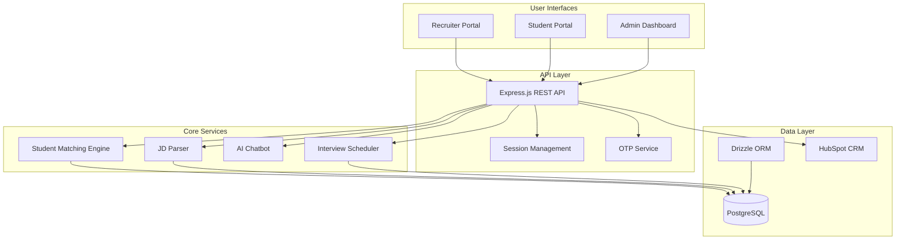
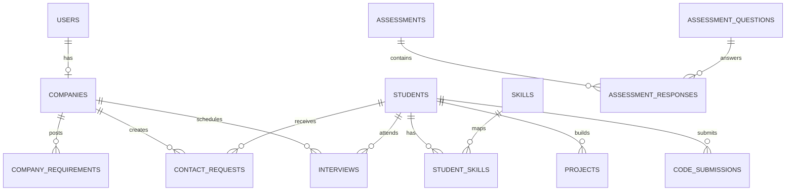

# NxtWave EDGE - Platform Architecture

## Overview

NxtWave EDGE is a **B2B talent marketplace** that connects Indian companies with pre-assessed students. The platform replaces manual Excel-based workflows with an interactive portal featuring smart matching, shortlisting, and interview scheduling.

---

## Problem Statement

From internal meetings (`current_hiring_process.md`):

| Current Pain | Impact |
|--------------|--------|
| Manual Excel sheets shared with companies | Poor client impression, no search/filter |
| Feedback via WhatsApp/phone calls | Lost, unstructured, hard to track |
| Interview scheduling requires back-and-forth | Time-consuming, error-prone |
| 15+ interview rounds with no centralized tracking | Chaos for both sides |
| Screening reports as PDFs | Not interactive, can't compare |

---

## Platform Solution

### Architecture Diagram



---

## User Roles

### 1. Admin (NxtWave Team)
- Manage student pool (327+ profiles)
- Create & edit company accounts
- Post job requirements
- Generate screening reports
- Monitor platform analytics
- Coordinate interview scheduling

### 2. Recruiter (Company)
- Browse & filter student profiles
- View assessment scores (DSA, CS, Aptitude, Communication)
- Shortlist candidates
- Compare candidates side-by-side
- Schedule interviews
- Track hiring pipeline status

### 3. Student (Candidate)
- Complete standardized assessment
- View recommendation rating
- Build profile with projects
- Track application status
- Receive interview invitations

---

## Automated Hiring Workflow

```
┌─────────────────┐    ┌─────────────────┐    ┌─────────────────┐
│  1. Requirement  │───▶│  2. Smart       │───▶│  3. Curated     │
│     Intake       │    │     Matching    │    │     Pool        │
│                  │    │                  │    │                  │
│  Company submits │    │  AI scores 327+  │    │  Top candidates  │
│  JD → System     │    │  students against│    │  with scores &   │
│  parses skills   │    │  requirements    │    │  recommendations │
└─────────────────┘    └─────────────────┘    └─────────────────┘
                                                        │
                                                        ▼
┌─────────────────┐    ┌─────────────────┐    ┌─────────────────┐
│  6. Track &     │◀───│  5. Interview   │◀───│  4. Shortlist   │
│     Hire        │    │     Schedule    │    │     & Compare   │
│                  │    │                  │    │                  │
│  Pipeline       │    │  Integrated      │    │  Recruiter       │
│  tracking →     │    │  scheduling with │    │  shortlists,     │
│  Offer → Hire   │    │  calendar sync   │    │  compares side-  │
└─────────────────┘    └─────────────────┘    │  by-side         │
                                               └─────────────────┘
```

---

## Database Schema

### Core Tables (15 total)

| Table | Purpose | Key Relationships |
|-------|---------|-------------------|
| `users` | Recruiter accounts | 1:1 with companies |
| `companies` | Company profiles | 1:N requirements, contacts |
| `students` | Pre-assessed candidates | N:M skills, 1:N projects |
| `company_requirements` | Job postings | N:1 companies |
| `skills` | Master skill catalog (42+) | N:M students |
| `student_skills` | Student-skill mapping | Junction table |
| `projects` | Student portfolios | N:1 students |
| `contact_requests` | Recruiter interest | N:1 companies, students |
| `assessments` | Assessment instances | N:1 users, 1:N responses |
| `assessment_questions` | Question bank | 1:N responses |
| `assessment_responses` | Individual answers | N:1 assessments, questions |
| `code_submissions` | Coding solutions | N:1 students |
| `interviews` | Interview scheduling | N:1 companies, students |
| `messages` | Communication | N:1 users |
| `otp_codes` | OTP lifecycle | Audit trail |

### Entity Relationship



---

## API Endpoints

### Authentication
| Method | Endpoint | Description |
|--------|----------|-------------|
| POST | `/api/auth/send-otp` | Step 1: Send OTP to email |
| POST | `/api/auth/verify-otp` | Step 2: Verify OTP, create session |
| GET | `/api/auth/user` | Get current authenticated user |
| POST | `/api/auth/logout` | Destroy session |

### Students
| Method | Endpoint | Description |
|--------|----------|-------------|
| GET | `/api/students` | List/filter students |
| GET | `/api/students/:id` | Get student detail |
| POST | `/api/students/job-match` | Score students against role |
| POST | `/api/students/smart-discovery` | AI-powered talent curation |

### Companies
| Method | Endpoint | Description |
|--------|----------|-------------|
| GET | `/api/company` | Get company by user |
| POST | `/api/company/register` | Register new company |
| POST | `/api/company/requirements` | Create job requirement |
| POST | `/api/company/parse-jd` | Parse JD text/PDF |

### Shortlisting
| Method | Endpoint | Description |
|--------|----------|-------------|
| POST | `/api/contact-requests` | Create contact request |
| GET | `/api/contact-requests` | List company's requests |
| POST | `/api/send-shortlist-email` | Send shortlist notifications |

### Interviews
| Method | Endpoint | Description |
|--------|----------|-------------|
| POST | `/api/interviews` | Schedule interview |
| GET | `/api/interviews` | List interviews |

### Communication
| Method | Endpoint | Description |
|--------|----------|-------------|
| POST | `/api/messages` | Send message |
| GET | `/api/messages` | List messages |
| POST | `/api/chatbot` | AI assistant (GPT-4o-mini) |

---

## Smart Matching Algorithms

### 1. Basic Job Match (`/api/students/job-match`)
```
Score = 40% Assessment Base
      + 30% Recommendation Tier
      + 20% Role Keyword Match
      + 10% Location Match
      + Salary Adjustment
```

### 2. Extended Job Match (`/api/students/job-match-by-id`)
Adds: CGPA filter, preferred college matching, experience level adjustment, skill keyword matching

### 3. Smart Discovery (`/api/students/smart-discovery`)
```
Score = 25% CGPA
      + 35% Skills Match
      + 15% College Reputation
      + 10% Salary Alignment
      + 10% Location
      + 5% Work Mode
```

### College Tier Scoring
| Tier | Colleges | Score |
|------|----------|-------|
| Tier 1 | IITs | 100 |
| Tier 2 | NITs, IIITs | 95 |
| Tier 3 | BITS, VIT, SRM, Manipal | 90 |
| Tier 4 | DTU, NSUT, Anna | 85 |
| Tier 5 | Other reputed | 75 |

---

## Technology Stack

| Layer | Technology | Purpose |
|-------|------------|---------|
| Frontend | React 18, TypeScript | UI Library |
| Build | Vite 5 | Bundler + HMR |
| Routing | Wouter | Client-side routing |
| UI Components | Shadcn/ui (47) | Pre-built components |
| Styling | Tailwind CSS | Utility-first CSS |
| State | TanStack Query | Server state management |
| Forms | React Hook Form + Zod | Form validation |
| Backend | Express.js | REST API |
| Database | PostgreSQL (Neon) | Serverless DB |
| ORM | Drizzle ORM | Schema-first ORM |
| Auth | Custom OTP | Email verification |
| AI | OpenAI GPT-4o-mini | Chatbot |
| CRM | HubSpot | Contact sync |
| Email | SendGrid | OTP + notifications |

---

## Key Features

### 1. OTP-Based Authentication
- Corporate email only (50+ personal domains blocked)
- In-memory OTP store with throttling
- 10-minute expiry, 5-attempt limit, 30-second cooldown

### 2. Smart Candidate Matching
- Multi-factor scoring engine
- 3 matching algorithms (basic, extended, smart)
- Real-time filtering by skills, location, salary, college

### 3. Shortlisting & Comparison
- In-memory shortlist (Set-based)
- Side-by-side candidate comparison
- Bulk contact request creation

### 4. JD Parsing
- PDF upload support
- Text extraction and skill identification
- Automatic requirement population

### 5. AI Chatbot
- GPT-4o-mini powered assistant
- Platform navigation help
- Suggested prompts

### 6. HubSpot CRM Sync
- Auto-upsert contacts on profile update
- Deal creation on job requirement
- Company sync

---

## Deployment

- **Platform**: Replit (with Cloud Run health checks)
- **Database**: Neon Serverless PostgreSQL
- **Email**: SendGrid
- **AI**: OpenAI API
- **CRM**: HubSpot (via Replit Connectors)

---

## Stakeholder Presentation

Open `ARCHITECTURE_DIAGRAM.html` in a browser for an interactive visual presentation of the architecture, including:
- Pain points vs solutions
- System architecture diagram
- User roles & capabilities
- Hiring workflow steps
- Data flow & integrations
- Database schema
- Technology stack
- Platform metrics
